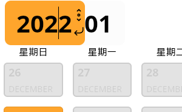
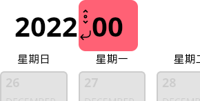
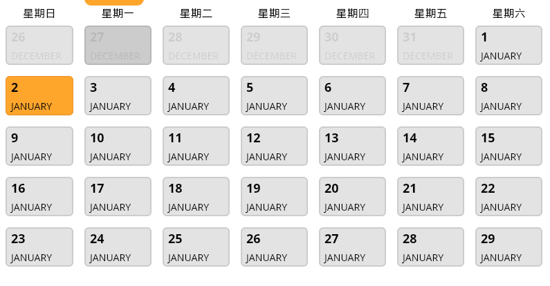
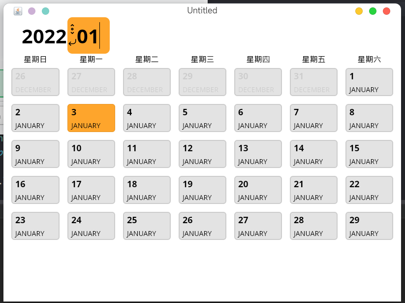

# 日历

> 一个用于[compose-desktop](https://github.com/JetBrains/compose-jb)的日历组件。

### 截图






## feature

- DayPicker的动画
- 月份选择器错误提示
- 点击非本月的时间会跳到上个月

## todo

- 年月份的滚动选择

## 使用

> 日历选择器目前有分为两部分：DayPicker 和 MonthPicker
> 
### CalendarState

保存日历显示时间和选择的时间。

### DayPicker

```kotlin
fun DayPicker(
    modifier: Modifier = Modifier,
    state: CalendarState,
    fromSunday: Boolean = true, // 每周是否从周日开始
    contentColor: Color,
    primaryColor: Color,
    hoverColor: Color,
    content: @Composable DayPickerScope.() -> Unit
) 
```

#### DayPickerScope

可以在content中获取下面的信息

```kotlin
interface DayPickerScope {
    val isSelected: Boolean
    val isHover: Boolean
    val date: LocalDate
}
```
例子

```kotlin
DayPicker(
            state = state,
            contentColor = Color.Black,
            primaryColor = Color(0xFFFEA52C),
            hoverColor = Color(0xFFE3E3E3),
        ){
            Text(
                text = "${date.dayOfMonth}", style = androidx.compose.ui.text.TextStyle(
                    fontWeight = FontWeight(600),
                    fontSize = 18.sp,
                ),
                modifier = Modifier.height(30.dp)
            )
            Text(text = "${date.month}")
        }
```

### MonthPicker

```kotlin
fun MonthPicker(
    modifier: Modifier = Modifier,
    state: CalendarState,
    contentColor: Color,
    primaryColor: Color,
    hoverColor: Color,
    errorColor: Color,
) 
```

### 使用这个例子

```kotlin

    val state:CalendarState = rememberCalendarState()

    Column {
        MonthPicker(
            state = state,
            contentColor = Color.Black,
            primaryColor = Color(0xFFFEA52C),
            hoverColor = Color(0xFFE3E3E3),
            errorColor = Color(0xFFFF6175),
        )
        DayPicker(
            state = state,
            contentColor = Color.Black,
            primaryColor = Color(0xFFFEA52C),
            hoverColor = Color(0xFFE3E3E3),
        ){
            Text(
                text = "${date.dayOfMonth}", style = androidx.compose.ui.text.TextStyle(
                    fontWeight = FontWeight(600),
                    fontSize = 18.sp,
                ),
                modifier = Modifier.height(30.dp)
            )
            Text(text = "${date.month}")
        }
    }

```